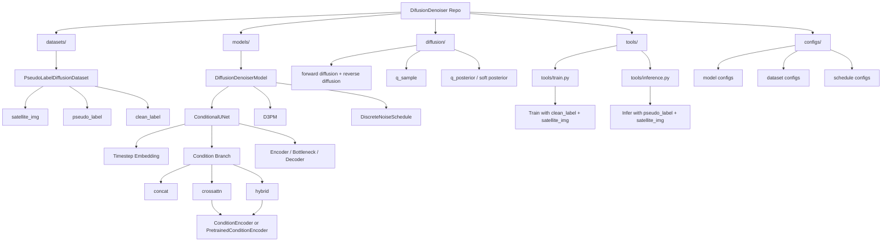
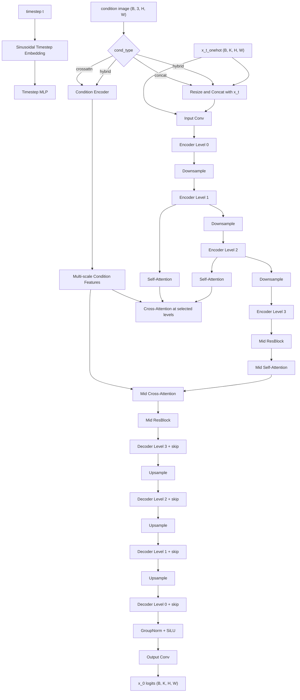

# DifusionDenoiser Architecture

This document summarizes the repository structure, the model architecture, and the train versus inference dataflow implemented in this codebase.

## 🧱 Codebase Architecture

The repository is organized around four main layers:
- data loading
- model definition
- diffusion process
- train and inference entrypoints

### Key Files

| Component | File |
| --- | --- |
| Dataset | `diffusion_denoiser/datasets/pseudo_label_dataset.py` |
| Top-level model | `diffusion_denoiser/models/diffusion_denoiser.py` |
| UNet | `diffusion_denoiser/models/conditional_unet.py` |
| D3PM logic | `diffusion_denoiser/diffusion/d3pm.py` |
| Noise schedule | `diffusion_denoiser/diffusion/noise_schedule.py` |
| Train entrypoint | `tools/train.py` |
| Inference entrypoint | `tools/inference.py` |

## 🧠 Model Architecture

`DiffusionDenoiserModel` is a wrapper that builds:
- `ConditionalUNet`
- `DiscreteNoiseSchedule`
- `D3PM`

At the network level, the denoiser is a conditional UNet that predicts `x_0` logits from:
- `x_t_onehot`
- timestep `t`
- satellite image condition

### Default Base Configuration

The common base model configuration uses:

| Field | Value |
| --- | --- |
| `num_classes` | `7` |
| `num_timesteps` | `100` |
| `base_channels` | `128` |
| `channel_mult` | `(1, 2, 4, 8)` |
| `num_res_blocks` | `2` |
| `attn_resolutions` | `(2, 4)` |
| `dropout` | `0.1` |

### Conditioning Modes

| `cond_type` | How condition enters the UNet |
| --- | --- |
| `concat` | Satellite image is resized and concatenated with `x_t_onehot` at input |
| `crossattn` | Satellite image is encoded into multi-scale features and injected by cross-attention |
| `hybrid` | Uses both concat and cross-attention |

### Condition Encoder Variants

| Encoder | Description |
| --- | --- |
| `ConditionEncoder` | Lightweight CNN condition pyramid |
| `PretrainedConditionEncoder` | Pretrained SegFormer or ResNet backbone with projection heads |

## 🔄 Train vs Inference Flow

The most important behavior difference in this repo is:
- training uses `clean_label` as `x_0`
- inference uses `pseudo_label` as the initialization of reverse diffusion

So although the dataset loads `pseudo_label` during training, the train forward path does not pass it into `model(...)`.

```mermaid
flowchart TD
    accTitle: Train and Inference Flow
    accDescr: Comparison of the training path and inference path in the DifusionDenoiser codebase, highlighting that training starts from clean ground-truth labels while inference starts from pseudo labels.

    subgraph train["Train Flow"]
        train_ds["Dataset batch"] --> train_sat["satellite_img"]
        train_ds --> train_clean["clean_label = x_0"]
        train_ds -. loaded but not used in forward .-> train_pseudo["pseudo_label"]

        train_clean --> train_t["Sample random timestep t"]
        train_t --> train_q["q_sample(x_0, t) -> x_t"]
        train_q --> train_oh["one_hot(x_t) -> x_t_onehot"]
        train_sat --> train_cond["condition = satellite_img"]
        train_oh --> train_unet["ConditionalUNet"]
        train_t --> train_unet
        train_cond --> train_unet
        train_unet --> train_logits["x_0 logits"]
        train_logits --> train_ce["Cross-Entropy with clean_label"]
        train_logits --> train_kl["KL via posterior matching"]
        train_clean --> train_ce
        train_clean --> train_kl
        train_q --> train_kl
        train_ce --> train_loss["loss_total"]
        train_kl --> train_loss
    end

    subgraph infer["Inference Flow"]
        infer_img["Input image"] --> infer_sat["satellite_img"]
        infer_pseudo_in["Input pseudo label"] --> infer_xt["x_T = pseudo_label"]
        infer_sat --> infer_cond["condition = satellite_img"]

        infer_xt --> reverse["Reverse diffusion loop: t = T-1 down to 0"]
        reverse --> infer_unet["ConditionalUNet"]
        infer_cond --> infer_unet
        infer_unet --> infer_logits["x_0 logits"]
        infer_logits --> infer_post["Compute p(x_t-1 | x_t)"]
        infer_post --> infer_sample["Sample x_t-1"]
        infer_sample --> reverse
        infer_logits --> infer_final["At t = 0: argmax(x_0 logits)"]
        infer_final --> refined["refined label"]
    end
```

### Practical Interpretation

| Phase | External inputs | What UNet actually sees |
| --- | --- | --- |
| Train | `clean_label`, `satellite_img` | `x_t_onehot`, `t`, `satellite_img` |
| Inference | `pseudo_label`, `satellite_img` | repeated `x_t_onehot`, `t`, `satellite_img` over the reverse loop |

### Code Anchors

| Behavior | File |
| --- | --- |
| Train loop calls `model(clean_label, satellite)` | `tools/train.py` |
| Validation denoises from `pseudo_label` | `tools/train.py` |
| Inference denoises from `pseudo_label` | `tools/inference.py` |
| Model forward delegates to `self.d3pm(clean_label, satellite_img)` | `diffusion_denoiser/models/diffusion_denoiser.py` |
| D3PM train samples `x_t` from `x_0` | `diffusion_denoiser/diffusion/d3pm.py` |
| D3PM inference starts from `noisy_label` if provided | `diffusion_denoiser/diffusion/d3pm.py` |

## 📌 Summary

This repo implements a discrete diffusion denoiser for segmentation maps:
- `train`: `clean_label -> q_sample -> x_t -> UNet -> recover x_0`
- `infer`: `pseudo_label -> reverse diffusion -> refined label`
- `condition`: always the normalized satellite image
- `core model`: conditional UNet inside a D3PM wrapper
