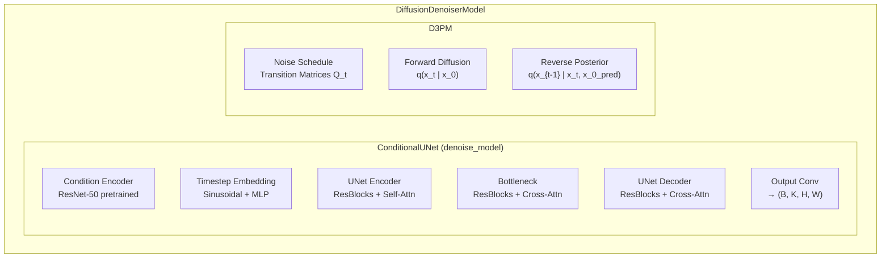
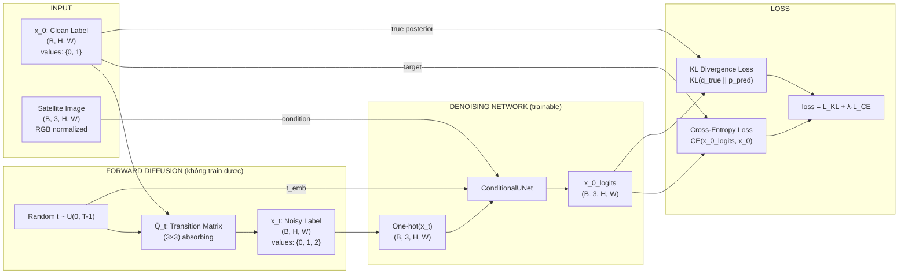
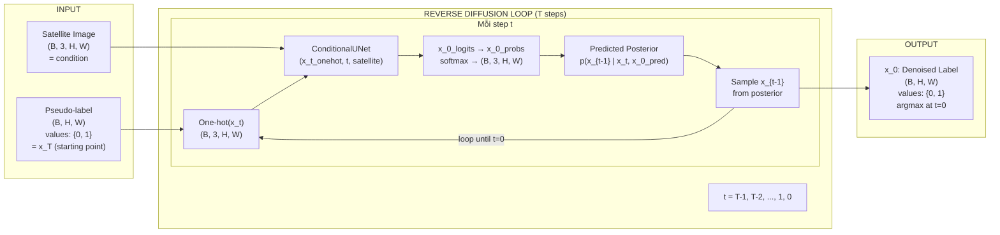

# Train D3PM Denoiser cho Binary Building Segmentation

## Mục tiêu
Adapt D3PM diffusion denoiser (hiện tại 7-class) để train cho **binary Building segmentation** (0=other, 1=Building) trên dataset `OEM_v2_Building`.

## Phân tích Data

| Property | Giá trị |
|---|---|
| Data path | `/home/ubuntu/vuong_denoiser/thietkedenoiser/data/OEM_v2_Building` |
| Classes | 0=other, 1=Building (binary) |
| Train / Val / Test | 1721 / 218 / 220 images |
| Image format | `.tif`, RGB uint8 |
| Label format | `.tif`, uint8 (values 0, 1) |
| Pseudo-label format | `.tif`, uint8 (values 0, 1) |
| Directory structure | Flat: `images/`, `labels/`, `pseudolabels/` + split files `train.txt`, `val.txt`, `test.txt` |

### Kích thước ảnh (đa dạng)

| Size | Số lượng |
|---|---|
| 1024×1024 | 1535 |
| 1000×1000 | 426 |
| 650×650 | 156 |
| 900×900 | 30 |
| 438×406 | 23 |
| 439×406 | 19 |

> [!NOTE]
> Images, labels, pseudo-labels đều cùng kích thước cho mỗi tile. Dataset class sẽ random crop 512×512 khi train và center crop khi val/test, nên kích thước khác nhau không ảnh hưởng.

---

## Kiến trúc Model: Training vs Inference

### Tổng quan kiến trúc



### 🔵 LÚC TRAIN



#### Chi tiết từng bước khi TRAIN:

| Step | Code location | Input → Output | Mô tả |
|---|---|---|---|
| **1. Load data** | `train.py:223-224` | Dataset → `satellite_img (B,3,H,W)`, `clean_label (B,H,W)` | Note: lúc train **KHÔNG dùng pseudo_label** — chỉ dùng clean_label |
| **2. Random t** | `d3pm.py:83` | → `t (B,)` random trong `[0, T-1]` | Timestep ngẫu nhiên cho mỗi sample |
| **3. Forward diffusion** | `noise_schedule.py:140-171` `q_sample(x_0, t)` | `x_0 (B,H,W)` → `x_t (B,H,W)` | Corrupt clean label bằng transition matrix Q̄_t. Pixel 0/1 có thể bị đổi thành 2 (absorbing) |
| **4. One-hot encode x_t** | `d3pm.py:109-110` | `x_t (B,H,W)` → `x_t_onehot (B,3,H,W)` | 3 channels: [is_other, is_building, is_masked] |
| **5. Condition encode** | `conditional_unet.py:580-584` | `satellite_img (B,3,H,W)` → `cond_feats [4 scales]` | ResNet-50 extract multi-scale features |
| **6. UNet forward** | `conditional_unet.py:775-853` | `(x_t_onehot, t, satellite_img)` → `x_0_logits (B,3,H,W)` | Cross-attention: UNet features attend to satellite features |
| **7. Hybrid loss** | `d3pm.py:117-153` | `(x_0, x_t, x_0_logits, t)` → `loss_total` | **KL loss**: true vs predicted posterior + **CE loss**: logits vs clean label |

> [!IMPORTANT]
> **Input Model = `x_t_onehot` (B, 3, H, W)** — corrupted label map (one-hot encoded, 3 channels)
>
> **Condition = `satellite_img` (B, 3, H, W)** — RGB ảnh vệ tinh, inject qua cross-attention
>
> **Target = `x_0` (B, H, W)** — clean ground-truth label (values 0, 1)
>
> **Output = `x_0_logits` (B, 3, H, W)** — logits predict cho 3 classes

---

### 🟢 LÚC INFERENCE (Denoise)



#### Chi tiết từng bước khi INFERENCE:

| Step | Code location | Input → Output | Mô tả |
|---|---|---|---|
| **1. Initialize x_T** | `d3pm.py:264-268` | `pseudo_label (B,H,W)` hoặc random | Pseudo-label từ model yếu làm starting point |
| **2. Loop t = T-1 → 0** | `d3pm.py:271-286` | Lặp T bước | Mỗi bước denoise 1 chút |
| **3. Predict x_0** | `d3pm.py:275` | `(x_t, t, satellite)` → `x_0_logits (B,3,H,W)` | UNet dự đoán clean label từ trạng thái hiện tại |
| **4. Compute posterior** | `d3pm.py:283` | `(x_0_probs, x_t, t)` → `posterior (B,H,W,3)` | p(x_{t-1} \| x_t) = Σ q(x_{t-1}\|x_t,x_0) · p(x_0\|x_t) |
| **5. Sample x_{t-1}** | `d3pm.py:284-286` | `posterior` → `x_{t-1} (B,H,W)` | Multinomial sampling từ posterior distribution |
| **6. Final (t=0)** | `d3pm.py:280` | `x_0_logits` → `argmax` → `x_0 (B,H,W)` | Lấy argmax trực tiếp, values = {0, 1} |

> [!IMPORTANT]
> **Input = `pseudo_label` (B, H, W)** — noisy pseudo-label từ model yếu (khởi tạo x_T)
>
> **Condition = `satellite_img` (B, 3, H, W)** — RGB ảnh vệ tinh (giữ nguyên qua mọi step)
>
> **Output = `denoised_label` (B, H, W)** — refined label sạch hơn, values {0, 1}

---

### So sánh Train vs Inference

| Aspect | Training | Inference |
|---|---|---|
| **Input model nhận** | `x_t_onehot` (corrupted clean label) | `x_t_onehot` (current noisy state) |
| **Condition** | `satellite_img` (RGB) | `satellite_img` (RGB) |
| **Target** | `x_0` (clean GT label) | Không có (unsupervised denoise) |
| **Nguồn noise** | Forward diffusion tự tạo từ clean label | Pseudo-label là "noise" ban đầu |
| **Số lần gọi UNet** | **1 lần** (1 random timestep t) | **T lần** (loop T-1 → 0) |
| **Pseudo-label** | ❌ Không dùng khi train | ✅ Dùng làm x_T khởi tạo |
| **Output** | `loss_total` (KL + CE) | `denoised_label (B,H,W)` |

---

## User Review Required

> [!IMPORTANT]
> **num_classes = 3** (không phải 2): D3PM với `transition_type='absorbing'` cần thêm 1 class "absorbing/mask" state (class 2). Clean labels chỉ chứa 0,1 — class 2 chỉ xuất hiện trong quá trình forward diffusion.
>
> Transition matrix (3×3): Non-building & Building pixels có thể bị corrupt sang class 2 (absorbing) với xác suất β_t.

> [!WARNING]
> **Dataset hiện tại dùng directory listing**, nhưng `OEM_v2_Building` dùng **split files** (train.txt/val.txt). Cần modify dataset class để hỗ trợ `split_file`.

## Proposed Changes

### Dataset Class

#### [MODIFY] [pseudo_label_dataset.py](file:///home/ubuntu/vuong_denoiser/BUILDING/DifusionDenoiser/DifusionDenoiser/diffusion_denoiser/datasets/pseudo_label_dataset.py)

Thêm parameter `split_file` để đọc danh sách filenames từ txt file thay vì listing toàn bộ directory:

```diff
 def __init__(self,
              data_root: str,
              img_dir: str,
              pseudo_label_dir: str,
              ann_dir: str,
              num_classes: int,
+             split_file: str = None,
              crop_size: Tuple[int, int] = (512, 512),
              img_suffix: str = '.tif',
              label_suffix: str = '.png',
              ...):
     ...
-    self.filenames = sorted([
-        f for f in os.listdir(self.img_dir)
-        if f.endswith(self.img_suffix)])
+    if split_file:
+        split_path = osp.join(data_root, split_file)
+        with open(split_path) as f:
+            self.filenames = [line.strip() for line in f if line.strip()]
+    else:
+        self.filenames = sorted([
+            f for f in os.listdir(self.img_dir)
+            if f.endswith(self.img_suffix)])
```

---

### Config Files

#### [NEW] [d3pm_crossattn_absorbing_resnet50_building.py](file:///home/ubuntu/vuong_denoiser/BUILDING/DifusionDenoiser/DifusionDenoiser/configs/_base_/models/d3pm_crossattn_absorbing_resnet50_building.py)

Model config cho binary Building (num_classes=3):

```python
num_classes = 3

model = dict(
    type='DiffusionDenoiserModel',
    num_classes=num_classes,
    num_timesteps=100,
    base_channels=128,
    channel_mult=(1, 2, 4, 8),
    num_res_blocks=2,
    attn_resolutions=(2, 4),
    dropout=0.1,
    cond_type='crossattn',
    cond_channels=3,
    cond_base_channels=64,
    cond_encoder_type='pretrained',
    pretrained_cond_cfg=dict(
        backbone_type='resnet50',
        pretrained='open-mmlab://resnet50_v1c',
        freeze_stages=1,
        out_channels=[64, 128, 256, 512],
    ),
    transition_type='absorbing',
    beta_schedule='cosine',
    loss_type='hybrid',
    hybrid_lambda=0.01)
```

#### [NEW] [pseudo_label_building.py](file:///home/ubuntu/vuong_denoiser/BUILDING/DifusionDenoiser/DifusionDenoiser/configs/_base_/datasets/pseudo_label_building.py)

Dataset config cho `OEM_v2_Building` — sử dụng `split_file` và `label_suffix='.tif'`:

```python
dataset_type = 'PseudoLabelDiffusionDataset'
data_root = 'data/OEM_v2_Building'
num_classes = 3

img_norm_cfg = dict(
    mean=[123.675, 116.28, 103.53],
    std=[58.395, 57.12, 57.375])

crop_size = (512, 512)

data = dict(
    samples_per_gpu=4,
    workers_per_gpu=4,
    train=dict(
        type=dataset_type, data_root=data_root,
        img_dir='images', ann_dir='labels', pseudo_label_dir='pseudolabels',
        split_file='train.txt', num_classes=num_classes, crop_size=crop_size,
        img_suffix='.tif', label_suffix='.tif', img_norm_cfg=img_norm_cfg,
        is_train=True),
    val=dict(
        type=dataset_type, data_root=data_root,
        img_dir='images', ann_dir='labels', pseudo_label_dir='pseudolabels',
        split_file='val.txt', num_classes=num_classes, crop_size=crop_size,
        img_suffix='.tif', label_suffix='.tif', img_norm_cfg=img_norm_cfg,
        is_train=False),
    test=dict(
        type=dataset_type, data_root=data_root,
        img_dir='images', ann_dir='labels', pseudo_label_dir='pseudolabels',
        split_file='test.txt', num_classes=num_classes, crop_size=crop_size,
        img_suffix='.tif', label_suffix='.tif', img_norm_cfg=img_norm_cfg,
        is_train=False))
```

#### [NEW] [d3pm_crossattn_absorbing_resnet50_building_512x512_100k.py](file:///home/ubuntu/vuong_denoiser/BUILDING/DifusionDenoiser/DifusionDenoiser/configs/denoiser/d3pm_crossattn_absorbing_resnet50_building_512x512_100k.py)

Top-level training config:

```python
_base_ = [
    '../_base_/models/d3pm_crossattn_absorbing_resnet50_building.py',
    '../_base_/datasets/pseudo_label_building.py',
    '../_base_/default_runtime.py',
    '../_base_/schedules/schedule_100k.py',
]

data = dict(samples_per_gpu=4, workers_per_gpu=4)
optimizer = dict(lr=5e-5)
```

---

### Training Script

#### [MODIFY] [train.py](file:///home/ubuntu/vuong_denoiser/BUILDING/DifusionDenoiser/DifusionDenoiser/tools/train.py)

1. `evaluate()` — chỉ tính mIoU trên **real classes** (bỏ absorbing state class 2):

```diff
 def evaluate(model, val_loader, device, num_steps=10):
-    intersection = torch.zeros(model.num_classes, device=device)
-    union = torch.zeros(model.num_classes, device=device)
+    # Only evaluate real classes (exclude absorbing state = last class)
+    num_eval_classes = model.num_classes - 1
+    intersection = torch.zeros(num_eval_classes, device=device)
+    union = torch.zeros(num_eval_classes, device=device)
     ...
-        for c in range(model.num_classes):
+        for c in range(num_eval_classes):
```

---

### Data Setup

```bash
ln -sf /home/ubuntu/vuong_denoiser/thietkedenoiser/data/OEM_v2_Building \
       data/OEM_v2_Building
```

## Open Questions

> [!IMPORTANT]
> **Giữ absorbing noise + num_classes=3?** — Đây là cách chuẩn cho D3PM. Nếu muốn đổi sang `uniform` noise thì dùng num_classes=2 nhưng sẽ mất lợi thế của absorbing (mask corruption phù hợp hơn cho segmentation).

## Verification Plan

### Automated Tests
```bash
# Dry run 10 iterations
python tools/train.py configs/denoiser/d3pm_crossattn_absorbing_resnet50_building_512x512_100k.py \
    --work-dir work_dirs/building_test
```

### Manual Verification
- Kiểm tra output predictions có values {0, 1} (không phải 2/absorbing)
- Verify loss giảm sau vài trăm iterations
